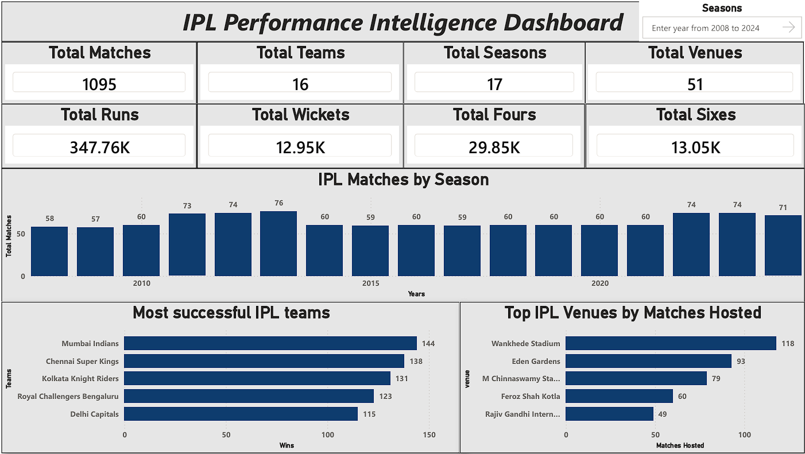
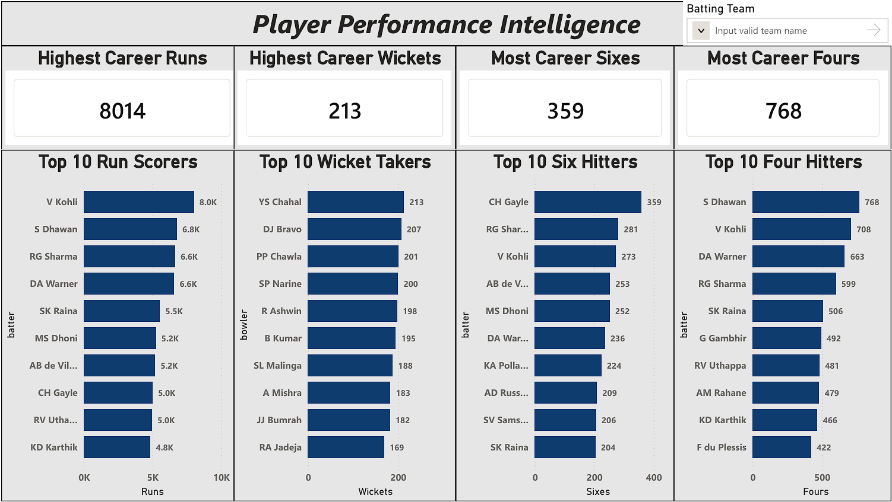
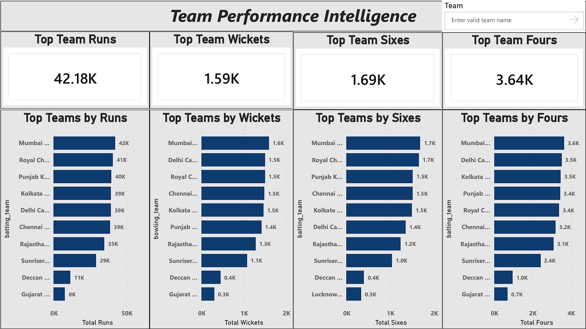

# IPL Performance Intelligence: End-to-End Cricket Analytics Project

## Project Overview

This project analyzes Indian Premier League (IPL) match and ball-by-ball data to uncover the factors that influence team performance and match outcomes.

The objective is to move beyond traditional cricket statistics and apply a structured analytics approach to understand:

* What drives winning in the IPL
* The impact of first-innings scores
* Powerplay and death-over performance
* Venue-specific characteristics
* Franchise benchmarking and consistency
* Strategic patterns associated with successful teams

The project follows a complete analytics workflow, beginning with raw data exploration and ending with executive-level insights and an interactive Power BI dashboard.

---

## Business Objectives

This project answers several key business and strategy questions:

* Does winning the toss improve the chances of winning?
* What is considered a defendable IPL score?
* How important is powerplay performance?
* Does wicket preservation influence match outcomes?
* Which venues favor chasing teams?
* Which franchises are most successful and consistent?
* Which teams perform best while chasing or defending totals?

---

## Dataset Information

**Source:** IPL Match-by-Match and Ball-by-Ball Dataset

### Files Used

* matches.csv
* deliveries.csv

### Dataset Contains

* Match-level information
* Ball-by-ball events
* Team performance metrics
* Toss decisions
* Venue details
* Batting and bowling outcomes

---

## Project Workflow

### 01 - Data Understanding

* Dataset exploration
* Data structure analysis
* Missing value identification
* Initial observations

### 02 - Data Cleaning

* Missing value handling
* Team name standardization
* Date formatting
* Data quality checks

### 03 - Feature Engineering

* Toss conversion indicators
* Chasing indicators
* Match outcome metrics
* Analytical feature creation

### 04 - Venue Intelligence

* Venue-level performance analysis
* Chasing success rates
* High-scoring venue identification
* Competitive venue analysis

### 05 - Powerplay & Death Overs Analysis

* Powerplay scoring trends
* Death-over scoring efficiency
* Team benchmarking
* Phase-wise batting performance

### 06 - Win Factors & Match Outcome Analysis

* First-innings score impact
* Powerplay influence on winning
* Wicket preservation analysis
* Winning probability evaluation

### 07 - Team Intelligence & Franchise Benchmarking

* Franchise success metrics
* Chasing performance analysis
* Defending performance analysis
* Long-term consistency evaluation

### 08 - Executive Summary

* Consolidated business findings
* Strategic conclusions
* Executive-level recommendations

---

## Power BI Dashboard

### Page 1 – Executive Overview



**Features**

* Total Matches
* Total Teams
* Total Seasons
* Total Venues
* Total Runs
* Total Wickets
* Total Fours
* Total Sixes
* Seasonal Match Trends
* Most Successful IPL Teams
* Top IPL Venues by Matches Hosted

---

### Page 2 – Player Performance Intelligence



**Features**

* Highest Career Runs
* Highest Career Wickets
* Most Career Sixes
* Most Career Fours
* Top 10 Run Scorers
* Top 10 Wicket Takers
* Top 10 Six Hitters
* Top 10 Four Hitters
* Team-Based Player Analysis

---

### Page 3 – Team Performance Intelligence



**Features**

* Highest Team Runs
* Highest Team Wickets
* Highest Team Sixes
* Highest Team Fours
* Top Teams by Runs
* Top Teams by Wickets
* Top Teams by Sixes
* Top Teams by Fours
* Interactive Team Filtering

---

## Key Findings

### Winning the Toss Has Limited Impact

Teams winning the toss won approximately **50.6%** of matches, indicating that toss outcomes alone do not significantly influence results.

### First Innings Score Is a Major Win Factor

| Score Band | Bat First Win % |
| ---------- | --------------- |
| Below 140  | 19.3%           |
| 140–160    | 30.0%           |
| 160–180    | 50.0%           |
| 180–200    | 60.8%           |
| 200+       | 82.6%           |

A score of **180+ runs** emerges as a critical threshold for defending totals.

### Powerplay Performance Matters

Winning teams averaged:

**49.4 runs** in the powerplay

Losing teams averaged:

**43.7 runs** in the powerplay

### Wicket Preservation Matters

Winning teams lost:

**1.10 wickets** in the powerplay

Losing teams lost:

**1.75 wickets** in the powerplay

### Most Consistent Franchise

**Chennai Super Kings**

* Highest win percentage among established franchises
* Highest average wins per season
* Strongest long-term consistency profile

---

## Tools & Technologies

* Python
* Pandas
* NumPy
* Matplotlib
* Jupyter Notebook
* Power BI
* DAX
* Excel
* Git
* GitHub

---

## Repository Structure

```text
IPL-Performance-Intelligence/
│
├── data/
│
├── notebooks/
│   ├── 01_Data_Understanding.ipynb
│   ├── 02_Data_Cleaning.ipynb
│   ├── 03_Feature_Engineering.ipynb
│   ├── 04_Venue_Intelligence.ipynb
│   ├── 05_Powerplay_and_Death_Overs_Analysis.ipynb
│   ├── 06_Win_Factors_and_Match_Outcome_Analysis.ipynb
│   ├── 07_Team_Intelligence_and_Franchise_Benchmarking.ipynb
│   └── 08_Executive_Summary.ipynb
│
├── IPL_Performance_Intelligence.pbix
├── page1_overview.png
├── page2_player_intelligence.png
├── page3_team_intelligence.png
│
└── README.md
```

---

## Future Improvements

* Predictive Match Outcome Modeling
* Team Recommendation Engine
* Venue-Based Strategy Simulator
* Real-Time IPL Analytics Dashboard

---

## Author

**Sudhanshu Dhankhar**

Aspiring Data Analyst focused on transforming raw data into actionable business insights using Python, SQL, Excel, Power BI, and Data Visualization.
